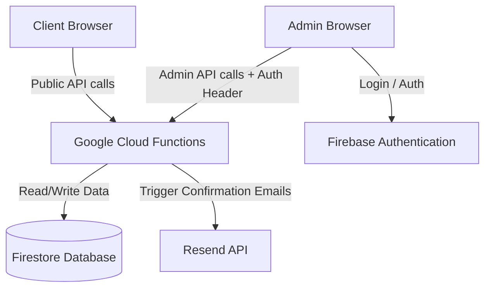

# Design Doc: Custom Calendar Booking System

* **Project**: Lisa Berger Psychotherapy Webpage
* **Date**: 2026-06-26
* **Status**: Approved

## 1. Architecture Overview

We are building a custom serverless booking system integrated into the static HTML landing page. The architecture utilizes Google Cloud Platform (GCP) and Firebase services to manage availability and appointments without requiring a dedicated virtual server.



---

## 2. Database Schema (Firestore)

### Collection: `slots`
Stores the individual dates and times the therapist is available.
```json
{
  "id": "string (doc_id)",
  "dateTime": "timestamp (UTC)",
  "duration": "number (50 | 90)",
  "type": "string (psychotherapie | paartherapie)",
  "status": "string (available | booked)",
  "bookingId": "string | null"
}
```

### Collection: `bookings`
Stores the client's information once a booking is confirmed.
```json
{
  "id": "string (doc_id)",
  "slotId": "string (slot_doc_id)",
  "dateTime": "timestamp (UTC)",
  "type": "string (psychotherapie | paartherapie)",
  "name": "string",
  "email": "string",
  "phone": "string | null",
  "notes": "string | null",
  "createdAt": "timestamp"
}
```

---

## 3. Backend API Endpoints (Node.js / Cloud Functions)

All backend endpoints are serverless functions deployed to GCP.

### Public Endpoints
* **`GET /getAvailableSlots`**: Returns all unbooked future slots from the `slots` collection.
* **`POST /bookAppointment`**:
  * Accepts: `{ slotId, name, email, phone, notes }`
  * Process:
    1. Runs a database transaction.
    2. Reads the `slot` document to verify `status == "available"`.
    3. If not available, returns an error (409 Conflict).
    4. If available, updates the `slot` status to `"booked"`, assigns `bookingId`, and writes a new `booking` document.
    5. Sends confirmation emails via the Resend API to both the client and the admin.

### Admin Endpoints (Requires valid Firebase Auth ID Token)
* **`GET /admin/getBookings`**: Returns upcoming and past appointments.
* **`POST /admin/createSlot`**: Creates a new slot in the `slots` collection.
* **`POST /admin/deleteSlot`**: Deletes a slot (if it is not booked).
* **`POST /admin/cancelBooking`**: Removes a booking, clears the slot status back to `"available"`, and notifies the client via email.

---

## 4. Frontend & User Interface

### Client Booking Panel
* Embedded as a slide-out drawer or overlay modal in `index.html`.
* Step-by-step wizard (Therapy selection -> Date/Time picker -> Contact info).
* Submits via AJAX/fetch to the public Cloud Functions API.

### Admin Dashboard (`/admin.html` & `/login.html`)
* Password protection using Firebase Authentication.
* Interface to quickly add availability slots.
* Chronological view of booked appointments.

---

## 5. Security & GDPR Compliance
* **Data Minimization**: Only mandatory fields (Name, Email) and basic optional fields (Phone, Notes) are stored.
* **API Protection**: Cloud Functions verify the ID token generated by Firebase Auth for all admin routes.
* **Resend API Key**: Stored securely as a Google Cloud secret variable, never exposed to the frontend.
